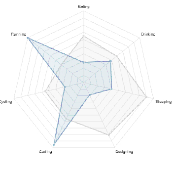

I will create a questionnaire that asks a series of questions about someone's personality and then assigns them levels for each personality category--extraoversion/introversion, intuition/sensing, feeling/thinking, and judging/perceiving. At the end, this will generate a chart displaying the degree of each personality type you fall into. I will use e.preventDefault() upon hitting submit so that a new page pops up over the page with the results. I will use chart.js to display results and use Backbone to make a model that saves the survey answers. 
Lastly, I will map each personality with a city and use Leaflet to point them towards the city they are most like in my results.

Concrete Goals: To understand how to use Chart.js, Leaflet, and creating a form that saves answers with Backbone.
Here are some images of what I hope to use in the results:

Included a very basic start of the html and css. Also, got the idea from this link: http://www.nytimes.com/interactive/2013/12/20/sunday-review/dialect-quiz-map.html?_r=0
(essentially want to do something similar)